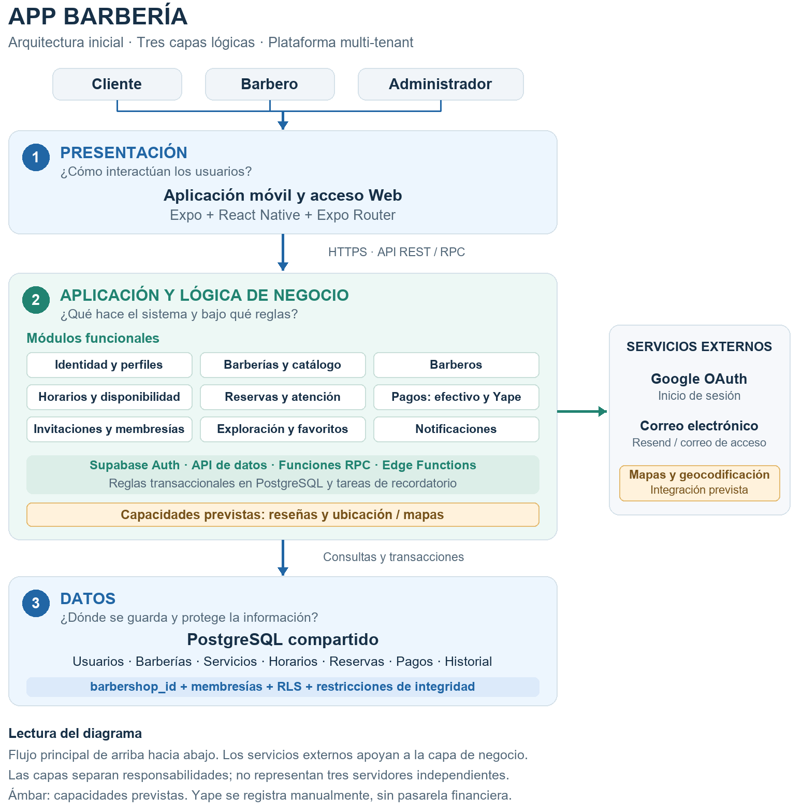

# Arquitectura inicial del sistema

## Enfoque arquitectónico

Se propone una arquitectura cliente-servidor de tres capas lógicas, organizada por funcionalidades y apoyada en Supabase como backend administrado. La plataforma operará bajo un modelo SaaS multi-tenant con PostgreSQL compartido y aislamiento lógico entre barberías.

Esta propuesta es un diseño inicial de responsabilidades y relaciones. No afirma que la solución esté terminada ni que sus objetivos de calidad ya estén verificados. Las tres capas no equivalen a tres servidores separados: una función PostgreSQL puede ejecutar reglas de negocio y consultar datos dentro del mismo servicio.

## Arquitectura en tres capas

| Capa | Pregunta que responde | Responsabilidad | Elementos propuestos |
|---|---|---|---|
| Presentación | ¿Cómo interactúa el usuario? | Mostrar pantallas, recoger entradas, guiar los flujos y presentar sus resultados. | Expo, React Native, Expo Router; interfaces de cliente, barbero y administrador. |
| Aplicación y lógica de negocio | ¿Qué hace el sistema y bajo qué reglas? | Coordinar casos de uso, validar disponibilidad y estados, autorizar operaciones y gestionar integraciones. | Módulos funcionales, servicios de identidad, REST/RPC de Supabase, funciones transaccionales PostgreSQL y Edge Functions. |
| Datos | ¿Dónde y cómo se conserva la información? | Persistir entidades, relaciones e historial, mantener restricciones de integridad y aplicar políticas de acceso. | PostgreSQL, relaciones por barbería, índices, restricciones, RLS y migraciones. |

## Módulos y responsabilidades

| Módulo | Responsabilidad principal | Requisitos relacionados |
|---|---|---|
| Identidad y perfil | Registro, acceso, recuperación de contraseña, sesión y datos personales. | RF01-RF05 |
| Barberías y administración | Datos del establecimiento, políticas, publicación y supervisión de agenda. | RF26-RF29, RF36 |
| Exploración y favoritos | Consulta del catálogo público y establecimientos preferidos. | RF06-RF08 |
| Catálogo de servicios y estilos | Servicios, precios, duración y estilos asociados. | RF30, RF31 |
| Barberos | Perfil profesional, relación con la barbería y asignación de servicios. | RF21, RF32 |
| Horarios y disponibilidad | Horarios generales e individuales, cierres, bloqueos y cálculo de intervalos disponibles. | RF10-RF12, RF22, RF27, RF33 |
| Reservas | Selección de atención, confirmación, consultas, reprogramación, cancelación e historial. | RF09, RF13, RF14, RF16-RF19 |
| Atención y agenda | Agenda del profesional y transiciones de estado de las citas. | RF20, RF23, RF24 |
| Pagos | Medio de pago, confirmación manual, estados y registro de reembolso. | RF15, RF25, RF37, RF38 |
| Invitaciones y membresías | Incorporación de personal y permisos contextuales por barbería. | RF34, RF35, RF41, RF42 |
| Notificaciones | Eventos internos, lectura, ocultación, navegación y recordatorios. | RF39, RF40 |
| Reseñas (previsto) | Valoraciones asociadas a atenciones completadas. | RF43 |
| Ubicación y mapas (previsto) | Ubicación de establecimientos y búsqueda por proximidad. | RF44 |

Los módulos son unidades lógicas del negocio, no servicios desplegados de forma independiente. La organización por funcionalidades permitirá reunir casos de uso, consultas, validaciones, tipos y componentes de cada capacidad.

## Diagrama de arquitectura

El diagrama se lee de arriba hacia abajo: actores, presentación, aplicación y negocio, y datos. La conexión lateral muestra los servicios externos que apoyan la capa de negocio. Las capacidades previstas se distinguen en color ámbar.



**Figura 1. Arquitectura inicial de App Barbería.** Los módulos representan responsabilidades lógicas; la seguridad y las reglas transaccionales también se aplican en el servidor. Las reseñas y los mapas son capacidades previstas. Yape se registra mediante confirmación manual.

## Dependencias y organización del código

La presentación dependerá de los casos de uso y módulos funcionales; estos accederán a los servicios mediante consultas, acciones y adaptadores. Los módulos de negocio no deberán depender de los detalles visuales de una pantalla.

La estructura técnica prevista será:

```text
src/
├── app/             Rutas, layouts y composición de navegación
├── features/        Capacidades del negocio
├── infrastructure/  Cliente, tipos y adaptadores de servicios
├── shared/          Componentes y utilidades reutilizables
└── theme/           Tokens y estilos visuales

supabase/
├── migrations/      Esquema, funciones y políticas versionadas
├── functions/       Integraciones de servidor
└── tests/           Pruebas de datos, permisos y operaciones
```


## Modelo multi-tenant y seguridad

Las barberías compartirán la base de datos y el esquema. Las entidades de cada establecimiento se relacionarán mediante barbershop_id, de forma directa o mediante relaciones verificables. Perfiles de usuario y notificaciones personales también requerirán reglas de propiedad por usuario.

Una membresía establecerá la relación entre usuario, barbería, rol y estado. El acceso administrativo o profesional se validará en cada operación. RLS limitará el acceso a filas y las funciones de servidor verificarán permisos, relaciones y estados antes de modificar datos.

El catálogo de una barbería publicada podrá ser consultable por los clientes, mientras que reservas ajenas, pagos y datos administrativos permanecerán protegidos. Ser administrador de una barbería no otorgará acceso a la información privada de otra.

## Principales grupos de datos

| Grupo | Información que se conservará |
|---|---|
| Identidad y participación | Usuarios autenticados, perfiles, membresías e invitaciones. |
| Establecimiento | Barberías, estado de publicación, configuración y datos de pago. |
| Oferta | Servicios, estilos, perfiles de barberos y asignaciones de servicios. |
| Calendario | Horarios generales, horarios de barberos, bloqueos y cierres. |
| Operación | Reservas, servicios de la reserva, condiciones históricas y pagos. |
| Preferencias y comunicación | Favoritos, notificaciones y control de recordatorios. |
| Ampliaciones previstas | Reseñas, ubicaciones geoespaciales y referencias a archivos multimedia. |

## Flujo principal de una reserva

1. El cliente inicia sesión y consulta una barbería visible.
2. Selecciona servicios, estilos opcionales y un barbero específico o cualquiera elegible.
3. El servidor calcula los intervalos disponibles según calendarios, duración y políticas.
4. El cliente elige un horario y medio de pago y solicita confirmar la reserva.
5. Una operación transaccional vuelve a validar permisos, disponibilidad y condiciones, asigna un barbero concreto y conserva los datos históricos relevantes.
6. Una restricción de intervalos en PostgreSQL protege contra reservas activas superpuestas. Si el intervalo ya está ocupado, la operación se rechaza y se solicita elegir otra opción.
7. El sistema devuelve la confirmación, genera avisos y programa los recordatorios que correspondan. Los fallos de comunicaciones secundarias no deben invalidar una reserva ya confirmada.
8. El personal autorizado registra el pago y gestiona el ciclo de atención mediante operaciones con validación de estado.

## Sistemas externos y tareas secundarias

| Integración | Responsabilidad y límite |
|---|---|
| Google | Identidad externa coordinada mediante Supabase Auth. No gestiona permisos por barbería. |
| Correo | Envío de invitaciones mediante Resend y mensajes de confirmación/recuperación mediante el mecanismo de autenticación configurado. La entrega no se considera garantizada por registrar una operación. |
| Mapas y geocodificación | Integración prevista a través de un adaptador. El cálculo de proximidad podrá apoyarse en PostGIS u otra capacidad equivalente, pendiente de validación técnica. |

Los recordatorios internos se generarán mediante tareas programadas, con control para evitar duplicar avisos de una misma cita. La carga de archivos se prevé mediante almacenamiento de objetos con políticas de acceso; inicialmente las imágenes podrán referenciarse mediante URLs seguras.


