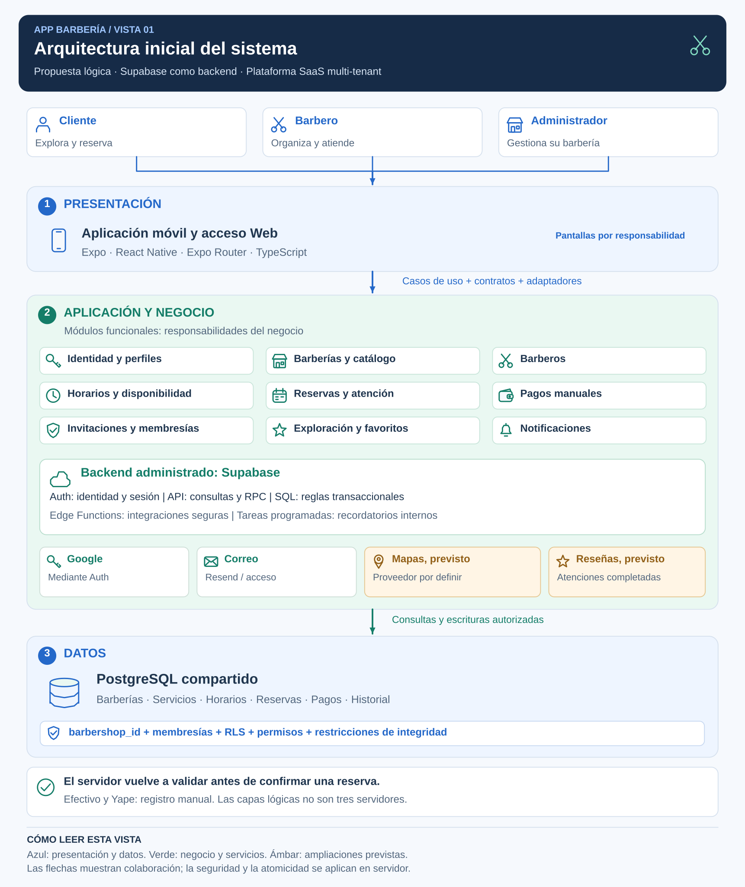

# Arquitectura inicial del sistema

## Definición y alcance

App Barbería utilizará una arquitectura cliente-servidor de tres capas lógicas, organizada por funcionalidades y apoyada en Supabase como backend administrado. Será una plataforma SaaS multi-tenant con PostgreSQL compartido y aislamiento lógico entre barberías.

La vista inicial responde a qué componentes participan y cómo colaboran. El [estilo arquitectónico](estilo-arquitectonico.md) describe la organización global; el [enfoque Clean Architecture](enfoque/enfoque-arquitectonico.md) define responsabilidades y dependencias internas.

Este documento presenta un diseño inicial. No afirma que las capacidades previstas estén terminadas o que los objetivos de calidad se hayan alcanzado.

## Diagrama general



**Figura 1. Vista lógica de la arquitectura inicial.** Se lee de arriba hacia abajo. Las flechas indican colaboración; no son relaciones entre tablas ni importaciones del código. Las tarjetas ámbar indican capacidades previstas.

## Capas lógicas

| Capa | Responsabilidad | Elementos propuestos |
|---|---|---|
| Presentación | Mostrar pantallas, recoger entradas, guiar el flujo y presentar resultados. | Expo, React Native y Expo Router; interfaces de cliente, barbero y administrador. |
| Aplicación y negocio | Coordinar casos de uso, validar disponibilidad y estados, autorizar operaciones y gestionar integraciones. | Módulos funcionales, contratos y adaptadores; Supabase Auth y API; funciones PostgreSQL y Edge Functions. |
| Datos | Persistir entidades, relaciones e historial y proteger integridad y acceso. | PostgreSQL compartido, políticas RLS, permisos, restricciones, índices y migraciones. |

Las capas no equivalen a tres servidores: una función PostgreSQL ejecuta reglas y accede a datos dentro del mismo servicio. Los casos de uso del cliente coordinan la interacción; el servidor toma las decisiones definitivas sobre operaciones protegidas.

## Módulos y responsabilidades

| Módulo | Responsabilidad principal | Requisitos |
|---|---|---|
| Identidad y perfil | Registro, acceso, recuperación, sesión y datos personales. | RF01-RF05 |
| Barberías y administración | Datos del establecimiento, políticas, publicación y supervisión de agenda. | RF26-RF29, RF36 |
| Exploración y favoritos | Catálogo público y establecimientos preferidos. | RF06-RF08 |
| Catálogo | Servicios, precios, duraciones y estilos. | RF30, RF31 |
| Barberos | Perfil profesional y asignación de servicios. | RF21, RF32 |
| Horarios y disponibilidad | Jornadas, cierres, bloqueos y cálculo de intervalos disponibles. | RF10-RF12, RF22, RF27, RF33 |
| Reservas | Selección, confirmación, consultas, reprogramación, cancelación e historial. | RF09, RF13, RF14, RF16-RF19 |
| Atención y agenda | Agenda y transiciones del estado de atención. | RF20, RF23, RF24 |
| Pagos | Medio de pago, confirmación manual y registro de reembolso. | RF15, RF25, RF37, RF38 |
| Invitaciones y membresías | Incorporación de personal y permisos por barbería. | RF34, RF35, RF41, RF42 |
| Notificaciones | Avisos internos, lectura, navegación y recordatorios. | RF39, RF40 |
| Reseñas, previsto | Valoraciones de atenciones completadas. | RF43 |
| Ubicación y mapas, previsto | Ubicación de establecimientos y búsqueda por proximidad. | RF44 |

Un módulo define un límite del negocio; no es un servicio desplegado de manera independiente. Su interfaz pública permite colaborar sin importar arbitrariamente detalles internos de otras funcionalidades.

## Organización técnica propuesta

```text
src/
├── app/              Rutas, layouts y composición de navegación
├── features/         Funcionalidades y separación interna gradual
├── infrastructure/   Cliente, tipos externos y adaptadores comunes
├── shared/           Componentes y utilidades con reutilización justificada
└── theme/            Tokens y estilos visuales

supabase/
├── migrations/       Esquema, funciones, permisos y políticas versionados
├── functions/        Integraciones seguras de servidor
└── tests/            Pruebas de datos, permisos y transacciones
```

La estructura por dominio, aplicación, presentación e infraestructura se detalla en el documento de enfoque. La organización propuesta no implica una reestructuración inmediata ni nuevas funcionalidades para este laboratorio.

## Multi-tenancy y seguridad

Las entidades del establecimiento se relacionan con barbershop_id de forma directa o mediante relaciones verificables. Los perfiles y avisos personales se protegen también por propiedad del usuario. No se añade una clave de barbería a datos globales sin una razón del modelo.

Una membresía relaciona usuario, barbería, rol y estado. El servidor verifica esa relación y la propiedad del recurso en cada operación protegida. Las políticas RLS limitan acceso a filas; los permisos de tablas y funciones restringen operaciones. Las funciones privilegiadas deben comprobar autorización explícitamente.

El catálogo publicado puede consultarse públicamente según las políticas. Reservas ajenas, pagos y administración siguen protegidos. Un administrador de una barbería no recibe acceso privado a otra.

## Flujo de confirmación de reserva

1. El cliente consulta una barbería que admite nuevas reservas y selecciona servicios y un barbero específico o cualquiera elegible.
2. El servidor calcula intervalos según horarios, cierres, bloqueos, reservas activas, duración y políticas.
3. El cliente elige horario y medio de pago y envía la solicitud mediante un caso de uso y un adaptador.
4. La función transaccional verifica identidad, permisos, elegibilidad, disponibilidad y condiciones vigentes; asigna un barbero concreto.
5. Guarda reserva, servicios, condiciones históricas y datos relacionados de pago y avisos internos que pertenezcan al evento.
6. Las restricciones de intervalos protegen contra superposición de reservas activas, incluida la separación entre citas. Ante conflicto o fallo, la operación se rechaza sin escrituras parciales.
7. Después de confirmar, el cliente recibe el resultado. Las entregas externas que correspondan se procesan separadamente; los recordatorios internos se generan según su programación.
8. El personal autorizado registra recepción de pago y gestiona la atención mediante cambios de estado validados.

La selección de efectivo o Yape no confirma recepción de dinero. Consultar un horario disponible tampoco garantiza su aceptación posterior: el servidor vuelve a verificarlo al confirmar.

## Integraciones y tareas secundarias

| Integración | Responsabilidad y límite |
|---|---|
| Google, mediante Supabase Auth | Identidad externa. No administra roles ni membresías por barbería. |
| Resend / correo de autenticación | Invitaciones y mensajes de acceso según la configuración. Registrar un evento o aceptar el envío no garantiza su entrega o lectura. |
| Tareas programadas PostgreSQL | Generación de recordatorios internos con control de duplicación. No equivale a notificaciones push. |
| Mapas y geocodificación, previsto | Proveedor por definir, acceso mediante adaptador; evaluar PostGIS o una capacidad equivalente. |
| Almacenamiento de objetos, previsto | Carga multimedia con políticas de acceso. Las referencias actuales pueden ser URLs; no se presume un flujo de carga implementado. |

Los avisos internos guardados en la transacción participan de su atomicidad. El correo externo queda fuera de ella. El registro persistente de envíos pendientes y sus reintentos se evaluará como evolución; no se presenta una cola o un outbox como mecanismo existente.

## Evolución y calidad

Se medirán consultas y operaciones antes de aumentar recursos o incorporar caché. Si se evalúan réplicas, se destinarán a lecturas adecuadas a su posible retraso; la confirmación y revalidación de reservas usarán la base principal.

Reseñas y ubicación son ampliaciones previstas. La incorporación de una API propia o microservicios exige una necesidad comprobada y una revisión de las [decisiones](../analisis-de-sistema/07-decisiones-arquitectonicas.md). El crecimiento por sí solo no obliga a cambiar de estilo.

Los criterios y objetivos pendientes de evaluación se encuentran en [atributos de calidad](../analisis-de-sistema/04-atributos-de-calidad.md) y [trazabilidad](trazabilidad-arquitectonica.md).
