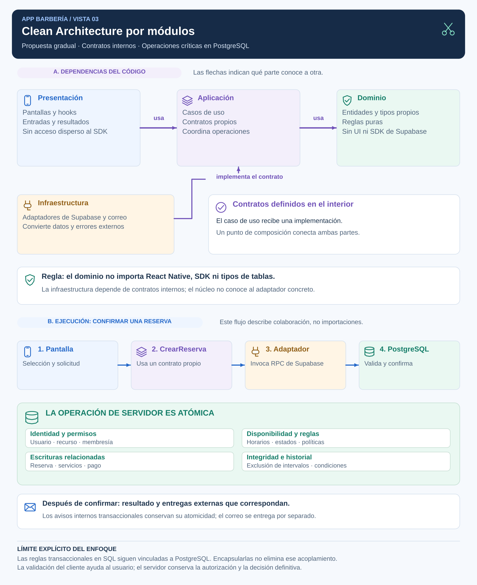

# Enfoque arquitectónico: Clean Architecture

## Objetivo y alcance

Separar responsabilidades y controlar dependencias para que las pantallas y los detalles de Supabase no se propaguen a las reglas y casos de uso de cada funcionalidad.

Se propone una adopción gradual por módulos. El dominio TypeScript será independiente de React Native, el SDK y los tipos generados de persistencia. Las operaciones transaccionales y parte de sus reglas seguirán en PostgreSQL por una decisión explícita; no se afirma una independencia completa del backend.

## Diagrama de dependencias



**Figura 3. Dependencias propuestas y flujo de una reserva.** La parte superior muestra importaciones hacia el interior. La inferior muestra colaboración en ejecución; su dirección no sustituye la regla de dependencias. PostgreSQL conserva la decisión definitiva de la operación.

## Responsabilidades

| Parte | Qué contiene | Ejemplos en Barbería | Dependencias permitidas |
|---|---|---|---|
| Dominio | Conceptos, tipos propios, valores y reglas puras del negocio. | Reserva, estado de atención, política de cancelación y transiciones permitidas. | Tipos y funciones del propio dominio; sin UI, SDK ni tipos de tablas. |
| Aplicación | Casos de uso, entradas/resultados y contratos necesarios para coordinar operaciones. | CrearReserva, ReprogramarReserva, CancelarReserva, ConfirmarPago; ReservaTransaccionalGateway. | Dominio y contratos internos; no implementaciones externas. |
| Presentación | Pantallas, componentes, hooks de interacción y estado visual. | Selección de horario, confirmación y mensajes de conflicto. | Casos de uso y modelos de presentación; no acceso arbitrario a datos del proveedor. |
| Infraestructura | Implementación de contratos y conversión de datos y errores externos. | SupabaseReservaAdapter, adaptador de correo y tipos generados de Supabase. | Contratos internos y librerías externas requeridas por cada adaptador. |

Un contrato de infraestructura se ubica en aplicación o dominio según la responsabilidad que lo necesita. Para confirmar una reserva transaccional, se define en aplicación. No se crean interfaces genéricas sin una necesidad del caso de uso.

## Regla de dependencias

```text
Presentación ──> Aplicación ──> Dominio
Infraestructura ──> Contratos de Aplicación / Dominio
Composición ──> Casos de uso y adaptadores concretos
```

Los casos de uso conocen contratos, no el SDK. El adaptador implementa esos contratos. Un punto de composición conecta ambas partes; conocer las implementaciones allí es válido. Las rutas se mantienen delgadas y separadas de reglas de negocio.

La dirección de las dependencias corresponde al enfoque de la [referencia original de Clean Architecture](https://blog.cleancoder.com/uncle-bob/2012/08/13/the-clean-architecture.html). La cantidad de carpetas no demuestra su cumplimiento.

## Organización orientativa

```text
src/
├── app/                              Rutas, layouts y composición de navegación
├── composition/                      Ensamblaje propuesto de casos y adaptadores
├── features/
│   └── reservations/
│       ├── domain/                   Tipos y reglas independientes
│       ├── application/
│       │   ├── use-cases/            Crear, cancelar, reprogramar
│       │   └── ports/                Contrato de operación transaccional
│       ├── presentation/             Pantallas, componentes y hooks de interacción
│       └── infrastructure/           Adaptadores específicos y mapeo de datos
├── infrastructure/
│   └── supabase/                     Cliente y tipos externos compartidos
├── shared/                           Reutilización justificada
└── theme/                            Estilos y tokens

supabase/
├── migrations/                       Funciones, esquema, permisos y restricciones
├── functions/                        Integraciones de servidor
└── tests/                            Pruebas de autorización y transacciones
```

Es una estructura objetivo, no una afirmación de carpetas ya existentes ni una exigencia de reorganizar todo en este laboratorio. Los módulos simples pueden mantener menos archivos si sus responsabilidades y dependencias siguen claras.

## Ejemplo: crear una reserva

1. La pantalla recoge selección de servicios, barbero, horario y medio de pago.
2. CrearReserva valida la forma de su entrada y coordina la solicitud mediante ReservaTransaccionalGateway.
3. SupabaseReservaAdapter implementa el contrato, transforma los datos e invoca la RPC correspondiente con el contexto del usuario autenticado.
4. La función PostgreSQL verifica permisos, estados, elegibilidad, disponibilidad y políticas; ejecuta las escrituras relacionadas en una transacción.
5. El adaptador convierte el resultado o conflicto a un resultado interno y la presentación informa al usuario.

No se ejecutan desde el cliente llamadas independientes para crear reserva, servicios y pago. El contrato expresa la operación atómica completa y el servidor conserva su garantía.

## Reglas en cliente y servidor

| Ubicación | Responsabilidad y límite |
|---|---|
| Validación de presentación | Ayuda al usuario a corregir entradas; puede ser evitada por una solicitud modificada. |
| Dominio y casos de uso TypeScript | Expresan conceptos, reglas puras y coordinación; no son la frontera de autorización del sistema. |
| Funciones PostgreSQL | Aplican reglas definitivas de las operaciones protegidas y su consistencia transaccional. |
| Restricciones y RLS | Protegen integridad y acceso según su configuración y contexto de ejecución. |

Se identificará la autoridad de cada regla para evitar versiones contradictorias entre cliente y SQL. Los tipos generados representan el proveedor; el adaptador los transforma hacia el modelo interno. Las pruebas de contrato ayudarán a detectar diferencias de formato o estado.

Encapsular una función SQL no la convierte en dominio independiente. Se acepta este acoplamiento del backend para conservar atomicidad, proximidad a los datos y seguridad; la decisión y sus límites figuran en ADR-002 y ADR-006.

## Límites entre funcionalidades

Reservas consulta disponibilidad mediante un contrato definido y no modifica arbitrariamente tablas o detalles internos de Horarios. Pagos opera sobre la reserva autorizada y no obtiene permisos por importar un módulo. Las colaboraciones transaccionales se coordinan en servidor cuando necesitan consistencia conjunta.

Compartir tipos o utilidades requiere una responsabilidad estable. No se utilizará shared como depósito de todo el negocio ni se crearán dependencias circulares entre funcionalidades.