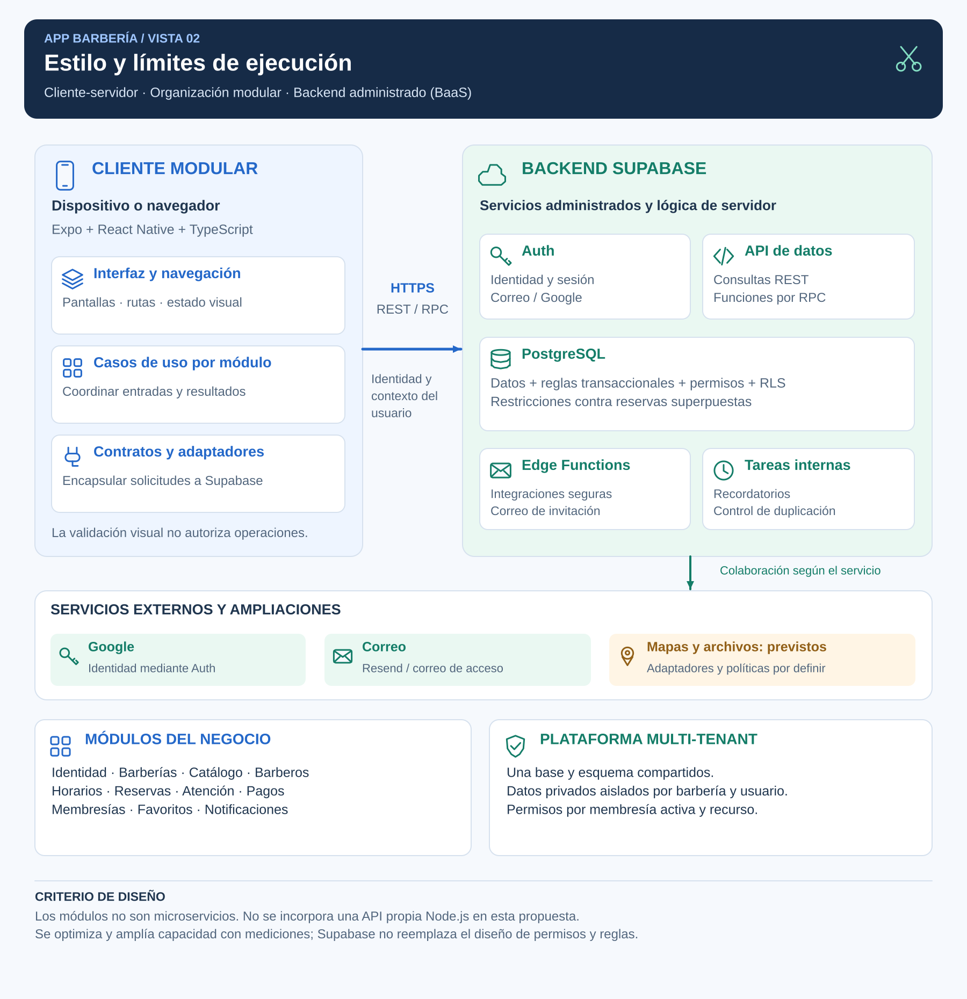

# Estilo arquitectónico

## Estilo seleccionado

**Arquitectura cliente-servidor con separación en capas lógicas, organización modular por funcionalidades y backend administrado mediante Supabase (Backend as a Service, BaaS).**

Esta descripción distingue comunicación, organización del código y servicios utilizados. El modelo SaaS multi-tenant define cómo varias barberías comparten la plataforma con aislamiento de datos; no sustituye al estilo arquitectónico.

## Diagrama de organización global

**Figura 2. Vista de servicios y límites de ejecución.** El cliente y el backend se comunican por HTTPS. Los módulos del cliente no representan microservicios; los componentes de Supabase son servicios de la plataforma. Las flechas describen colaboración en ejecución.

## Significado de cada dimensión

| Dimensión | Aplicación en Barbería |
|---|---|
| Cliente-servidor | El dispositivo presenta la interfaz y solicita operaciones a servicios de servidor. |
| Capas lógicas | Se distinguen presentación, aplicación/negocio y datos. Una función SQL puede realizar responsabilidades de negocio y persistencia en el mismo servicio. |
| Modularidad | Cada funcionalidad reúne responsabilidades cohesionadas y expone contratos para colaborar. |
| Backend administrado | Supabase aporta Auth, API de datos, PostgreSQL y ejecución de funciones de servidor; el proyecto define sus reglas y configuración. |
| SaaS multi-tenant | Varias barberías comparten infraestructura; el acceso privado se limita por membresía y recurso. |

## Modularidad, monolito y microservicios

Un monolito modular agrupa módulos del backend en una aplicación desplegable propia. Los microservicios de negocio tienen límites y despliegues independientes, con costos adicionales de coordinación y operación.

La decisión de App Barbería es utilizar un backend administrado y módulos funcionales. No se afirma que existe una API Node.js desplegada como monolito modular, ni que las funciones o servicios de Supabase constituyan microservicios de negocio desarrollados por el proyecto.

La modularidad se aplicará mediante responsabilidades, interfaces y reglas de dependencia. Una carpeta por funcionalidad no garantiza por sí sola un buen límite.

## Límites de ejecución

| Ubicación | Responsabilidad |
|---|---|
| Dispositivo o navegador | Pantallas, navegación, estado visual, validación orientativa y coordinación de solicitudes. |
| Supabase Auth | Identidad y sesión; las membresías del establecimiento siguen siendo parte del modelo del proyecto. |
| API de datos | Interfaz HTTPS para consultas autorizadas y llamadas RPC. No equivale a una API propia Node.js. |
| PostgreSQL | Datos, validación definitiva, transacciones, permisos, RLS, restricciones y tareas internas. |
| Edge Functions | Integraciones seguras de servidor como correo, según su necesidad y límites. |
| Proveedores externos | Identidad Google, entrega de correo y mapas previstos. |

La aplicación no contiene credenciales administrativas de PostgreSQL ni claves privilegiadas. La autorización real se ejecuta en servidor, aunque la interfaz ajuste las opciones visibles al rol.

## Justificación y alternativas

| Alternativa | Evaluación para este diseño |
|---|---|
| Backend Supabase con módulos y operaciones de servidor | Seleccionado: aprovecha servicios administrados y permite concentrar el trabajo en reglas, datos y experiencia. |
| API propia Node.js como monolito modular | Posible alternativa futura si aporta control o procesos concretos; no se incorpora solo para coincidir con una referencia de clase. |
| Microservicios de negocio | No seleccionados: no existe una necesidad demostrada de despliegue o escalamiento independiente de los módulos. |

## Crecimiento y responsabilidad

El crecimiento se evaluará con carga y volumen representativos, índices, consultas acotadas y monitoreo. Se contratarán recursos acordes a la demanda y al presupuesto. Una cantidad de cuentas registradas no demuestra capacidad para esa misma cantidad de solicitudes concurrentes.

Las réplicas de lectura, si se justifican, no sustituyen a la base principal para escrituras o revalidación de reservas. Una caché de disponibilidad no es autoridad para confirmar una cita.

Supabase administra infraestructura, pero el proyecto conserva la responsabilidad sobre esquema, acceso y arquitectura, como explica su [modelo de responsabilidad compartida](https://supabase.com/docs/guides/deployment/shared-responsibility-model). Su [API de datos](https://supabase.com/docs/guides/api) puede usarse desde el cliente o complementarse posteriormente con un servidor propio.

## Relación con las decisiones

ADR-001 establece la organización global; ADR-003 define presentación y comunicación; ADR-004 y ADR-005 determinan aislamiento y autorización; ADR-006 define las operaciones críticas; ADR-011 orienta el crecimiento. El enfoque interno se desarrolla en [Clean Architecture](enfoque/enfoque-arquitectonico.md).
